# Firebird DOOM

DOOM, simulated and rendered **inside the Firebird SQL database**, running entirely in your
browser on [Firebird 6 compiled to WebAssembly](https://github.com/mariuz/electric-firebird).

**▶ Play: https://mariuz.github.io/firebird-doom/**

The series went on to true 3D: [Firebird Quake](https://github.com/mariuz/firebird-quake), [Firebird Quake 2](https://github.com/mariuz/firebird-quake2) and [Firebird Quake III Arena](https://github.com/mariuz/firebird-quake3) ([play](https://mariuz.github.io/firebird-quake3/)), with Bézier patches, MD3 player models and deathmatch bots that think in SQL.

Every game tic is a PSQL procedure call. Every frame is a `SELECT`. JavaScript only reads the
keyboard and paints the rows Firebird returns.

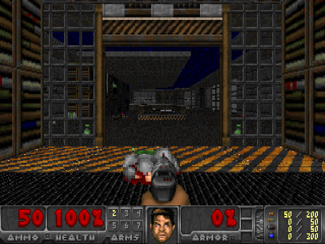

| | |
|---|---|
| 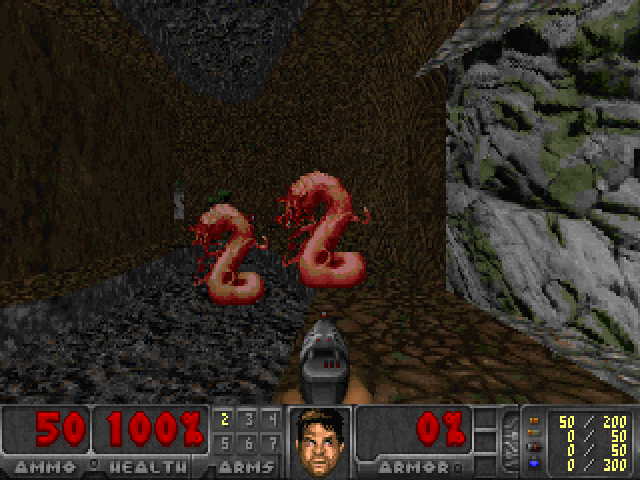 | 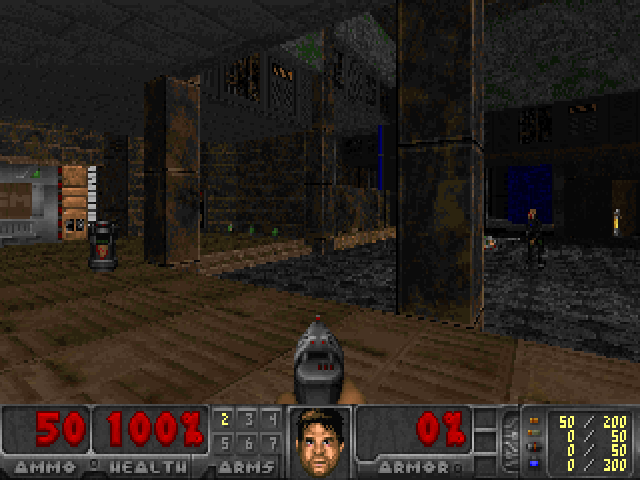 |
| 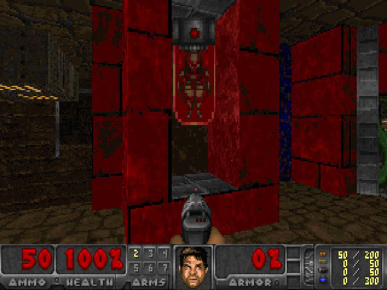 | 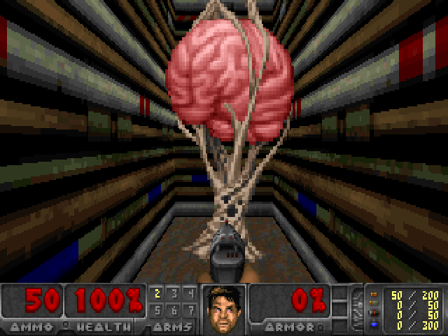 |
| 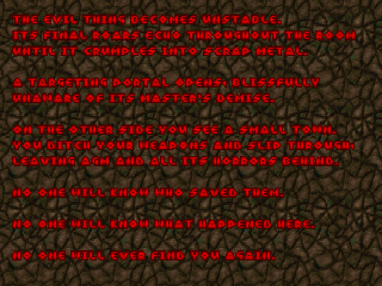 | 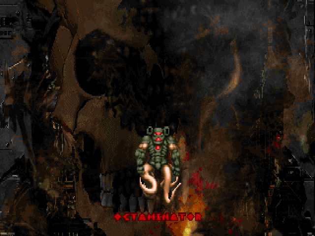 |
| 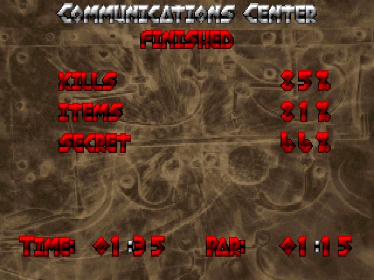 | 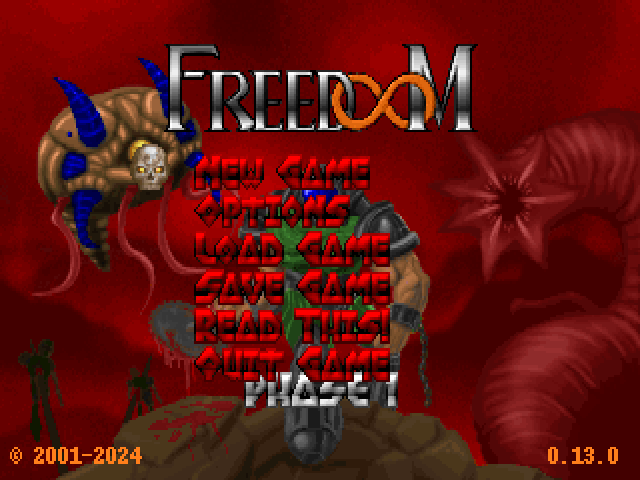 |
| 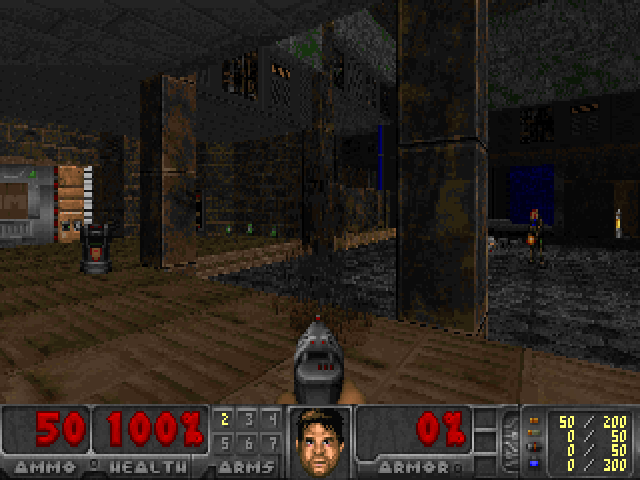 | 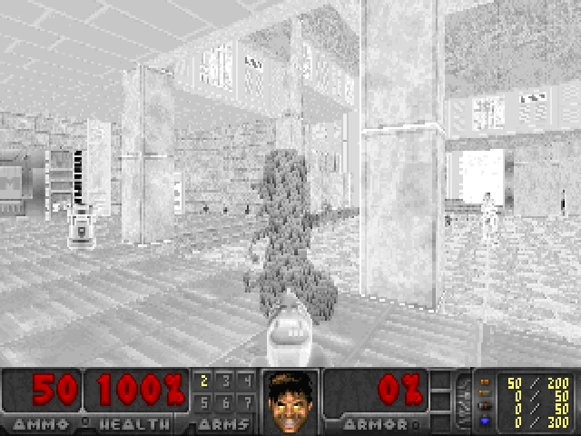 |

<sub>These screenshots come from `npm run screenshots`, which runs the same SQL and
rasteriser as the page, headless in Node.</sub>

This project follows CedarDB's [SQL DOOM](https://cedardb.com/blog/sqldoom/) (the original WAD,
rendered by a database) and [DOOMQL](https://cedardb.com/blog/doomql/) (a DOOM-like game in pure
SQL), and [DuckDB-DOOM](https://www.hey.earth/posts/duckdb-doom) (a SQL raycaster in the browser
through DuckDB-WASM). This one is graphical, plays real DOOM maps, and runs Firebird in the tab.

## How it works

```
 keyboard ─▶ SELECT * FROM doom_tic(tics, fwd, side, turn, fire, use, weapon, run)   ← game logic
             SELECT * FROM frame_walls      ← which wall slice is visible in which column
             SELECT * FROM frame_sprites    ← which sprite frame, where, how bright
             SELECT * FROM frame_sectors    ← live floor/ceiling heights and light
         ─▶ JS looks up texels + colormaps ─▶ <canvas>
```

| DOOM source | Firebird |
|---|---|
| WAD lumps `VERTEXES` `LINEDEFS` `SIDEDEFS` `SECTORS` `SEGS` `SSECTORS` `NODES` `THINGS` | tables of the same names ([sql/schema.sql](sql/schema.sql)) |
| `info.c` mobjinfo | `THING_TYPES` rows ([src/thinginfo.js](src/thinginfo.js)) |
| `R_PointInSubsector` | `SECTOR_AT()` walks the BSP; `INIT_MAP` locates every thing in one recursive CTE |
| `BLOCKMAP` | `LINE_BLOCKS`, a 128×128 grid built by `INIT_MAP` |
| `P_CheckPosition`, `P_TryMove` | `CHECK_POSITION`, plus wall sliding in `PLAYER_THINK` |
| `P_CheckSight` | `CHECK_SIGHT()` walks the blockmap cells along the sight line |
| `P_UseLines`, `P_CrossSpecialLine`, `EV_DoDoor/Plat/Floor`, stairs, exits | `ACTIVATE_LINE`, `MOVERS`, `MOVERS_THINK` |
| `G_DoCompleted`: which map comes next, secret exits included | [src/progress.js](src/progress.js) |
| `EV_DoCeiling` crushers, `EV_CeilingCrushStop`, `raiseFloorCrush`, `P_ChangeSector` | the `crush` mover kind, `CRUSH_THINGS` |
| `P_SpawnMissile` / `P_SpawnPlayerMissile` aiming, `P_AimLineAttack`, `P_ZMovement` for missiles | `MONSTER_MISSILE`, `FIRE_MISSILE`, `AIM_SLOPE`; 3D flight in `MONSTERS_THINK` |
| `A_Look` / `A_Chase` / attacks, pain, death, barrels | `MONSTERS_THINK` |
| `P_DamageMobj` retargeting, `PIT_CheckThing` species rule (infighting) | `DAMAGE_THING(..., src)`, `THINGS.TARGET_ID` / `THRESHOLD`, `HURT_TARGET` |
| `P_NoiseAlert`, `P_RecursiveSound` (gunfire wakes monsters) | `NOISE_ALERT` flooding `SOUND_LINKS`, `SECTORS.SOUND_HEARD` |
| `A_Tracer`, `A_SkelFist` (revenant), `A_FatAttack1/2/3` (mancubus), `A_VileTarget` / `A_Fire` / `A_VileAttack` / `A_VileChase` (arch-vile), `A_PainShootSkull` / `A_PainDie` | `MONSTERS_THINK` (the `melee`, `heal` and `raise` states, the `flame` kind), `MONSTER_MISSILE`, `PAIN_SHOOT_SKULL` |
| `A_BossDeath`, `A_KeenDie` | `BOSS_DEATH`, `KEEN_DIE` |
| `A_BrainSpit`, `A_SpawnFly`, `A_BrainScream` (the Icon of Sin) | the `shooter`, `cube` and `brain` kinds in `MONSTERS_THINK` |
| `MF_SPAWNCEILING` (hanging bodies, Commander Keen) | `THING_TYPES.HANG`, placed in `INIT_MAP` |
| `P_LineAttack`, `P_BulletSlope` (pistol, shotguns, chaingun, fist, chainsaw) | `HITSCAN` (in 3D, with a slope), `AIM_SLOPE` |
| `A_Saw`, `A_FireShotgun2` (chainsaw, super shotgun) | `HITSCAN` at melee range / 20 pellets; reload sounds timed in `PLAYER_THINK` |
| `P_SpawnPlayerMissile`, `P_RadiusAttack`, `A_BFGSpray` (rocket launcher, plasma gun, BFG) | `FIRE_MISSILE`, `RADIUS_ATTACK`, `BFG_SPRAY`; projectiles fly in `MONSTERS_THINK` |
| `P_TouchSpecialThing` | pickups in `PLAYER_THINK` |
| light flashes, strobes, glows | `LIGHTS_THINK` |
| `R_RenderBSPNode`, `R_CheckBBox`, `R_ClipSolidWallSegment` (solidsegs) | `RENDER_SLICES_BSP` ([sql/render.sql](sql/render.sql)) |
| `r_segs.c` clip arrays, `markceiling` / `markfloor` | `RENDER_WALLS` / `FRAME_WALLS` (or `FRAME_WALLS_WINDOWED`) |
| `r_plane.c` visplanes: `R_FindPlane`, `R_CheckPlane`, `R_MakeSpans`, `R_MapPlane` | `c_top`/`c_bot`/`f_top`/`f_bot` per slice, `FRAME_VISPLANES`; spans in [src/renderer.js](src/renderer.js) |
| `I_SetPalette` / `I_FinishUpdate`: palette indices to colours | [src/present.js](src/present.js): WebGL palette shader, Canvas 2D fallback |
| `r_things.c`, `R_DrawFuzzColumn` (`MF_SHADOW`) | `RENDER_SPRITES` / `FRAME_SPRITES` (its `fuzz` column); fuzz in [src/renderer.js](src/renderer.js) |
| `S_StartSound` (+ `sfxinfo` sounds per monster) | `PLAY_SOUND` / `SECTOR_SOUND` → `SOUND_EVENTS`; played by [src/audio.js](src/audio.js) |
| `I_PlaySong`, DMX's OPL driver, the YM3812 | [src/music.js](src/music.js) (MUS + MIDI), [src/dmx.js](src/dmx.js) (the driver), [src/opl.js](src/opl.js) (the chip), [src/opl-worklet.js](src/opl-worklet.js) |

### The renderer

There are two wall renderers. You can switch between them under **Renderer** in the page's
settings; the choice is stored in `VIEWCFG.USE_BSP`.

**BSP front to back with solidsegs (the default).** `RENDER_SLICES_BSP` walks `NODES` from the
root like `R_RenderBSPNode`, nearer child first. Before entering the farther child it projects
that child's bounding box onto the screen (`R_CheckBBox`) and skips the whole subtree if
every column it covers is already hidden. In each subsector it projects the segs that face the
viewer (`R_AddLine`). When a seg is solid (one-sided, or a closed door) its columns are marked
as covered (`R_ClipSolidWallSegment`). PSQL has no arrays, so DOOM's `solidsegs` list is a
`VARCHAR` with one character per screen column, and the traversal stack is a string too. The walk
stops when no `'0'` is left in the coverage string. On Freedoom's 36 maps this is **about 3×
faster** than brute force, and it finds exactly the same visible walls. CI checks that.

**Brute force.** `RENDER_SLICES` projects every linedef in front of the camera, whether or not
anything hides it.

Both generators transform into view space, clip to the near plane, and intersect each screen
column's ray with the seg. That gives an exact depth, a texture column, and the vertical
opening the seg leaves (`open_top`/`open_bot`) for whatever is behind it. `RENDER_WALLS` then
plays the part of DOOM's `ceilingclip[]`/`floorclip[]` arrays: `ORDER BY col, depth` sorts each
column front to back, and the clip window is carried down the column. The same idea, stated
declaratively, is the `FRAME_WALLS_WINDOWED` view:

```sql
SELECT *
  FROM (SELECT s.*,
               COALESCE(MAX(open_top) OVER (PARTITION BY col ORDER BY depth
                        ROWS BETWEEN UNBOUNDED PRECEDING AND 1 PRECEDING), 0) clip_top,
               COALESCE(MIN(open_bot) OVER (PARTITION BY col ORDER BY depth
                        ROWS BETWEEN UNBOUNDED PRECEDING AND 1 PRECEDING), 1e9) clip_bot
          FROM render_slices s)
 WHERE clip_top < clip_bot
```

The smoke test checks that `FRAME_WALLS_WINDOWED` matches `FRAME_WALLS` slice for slice. The
game uses the procedural clip because Firebird's window sort costs about twice as much.

Two Firebird-specific performance lessons:

* **Derived tables are inlined.** Each reference to a computed CTE column re-evaluates its whole
  expression tree, so a five-deep chain of projections took seconds. Generator procedures
  compute each value once into a variable. A PSQL loop runs at about 0.2 µs per statement in
  WASM.
* **Pin the join order.** Joining a computed range to `SCREEN_COLS` took 65 s as an inner join,
  because the optimizer drove from the wrong side. With `CROSS JOIN LATERAL` or `LEFT JOIN` it
  took 0.2 s.

### Floors and ceilings: visplanes

DOOM doesn't texture floors column by column. While drawing walls it records, for each column,
which rows of the front sector's ceiling and floor the wall leaves visible (`markceiling` and
`markfloor` in `R_StoreWallRange`). It collects those rows into **visplanes**: one per distinct
height, flat and light level, with at most one span per column. Then it draws each visplane as
horizontal spans, because every pixel in a row of a flat surface is the same distance away.

Here `RENDER_WALLS` returns those rows with every slice: `c_top`/`c_bot` for the ceiling and
`f_top`/`f_bot` for the floor, computed from the same clip window it uses for the walls. The
browser does `R_FindPlane`/`R_CheckPlane`. It groups the spans by (height, flat, light), starts
a new plane when a column is already taken, and merges all sky into one plane. `R_MakeSpans`
then sweeps each plane left to right, turning column spans into row spans. `R_MapPlane`
draws each row span with one distance and light lookup, stepping the texture coordinates
linearly. `SELECT * FROM frame_visplanes` shows the current frame's planes in the SQL console,
and the stats line under the view counts them. Across Freedoom's maps the busiest frame
needs 42, comfortably under vanilla DOOM's `MAXVISPLANES` of 128.

### The status bar face

The face is `ST_updateFaceWidget`'s, tic by tic (`FaceWidget` in [src/hud.js](src/hud.js)). It has
five pain levels by health, and in order of priority it shows:

1. dead;
2. the evil grin for two seconds after picking up a weapon you didn't have;
3. when something hurts you, a look towards it (left, right, or the rampage face if it's within
   45° ahead);
4. the rampage face when the world hurts you (slime, a crusher);
5. the rampage face after two seconds of holding the trigger;
6. the god face, with IDDQD or invulnerability;
7. otherwise, a glance straight, left or right every half second.

Vanilla's test for the "ouch" face is backwards (health has to *rise* by more than 20 while you're
hurt), so it hardly ever shows, and the port keeps that. `DAMAGE_PLAYER` records who hurt you
(`PLAYER.ATTACKER_ID`, empty for the world), and `DOOM_TIC` returns the angle to them. Dead, the
view turns to face your killer 5° a tic, and the red stays until it does (`P_DeathThink`).
`npm run test:statusbar` tests the face's rules headless, and the attacker and the death camera
in Firebird.

### Light diminishing

How dark a pixel gets is DOOM's own integer arithmetic ([src/renderer.js](src/renderer.js)):
`R_InitLightTables`' `zlight` and `R_ExecuteSetViewSize`' `scalelight`, 16 light levels by 32
colormaps. Walls and masked middles take `scalelight` by their projected scale
(`R_RenderSegLoop`), sprites likewise (`R_ProjectSprite`), and flats take `zlight` by distance
in 16-unit steps (`R_MapPlane`). Walls running due east–west or north–south get the fake contrast,
a light level darker or lighter. Vanilla's low-detail quirk is kept: halving the view's columns
halves a wall's scale but not the table, so in low detail walls come out darker at a distance,
while sprites (whose shift accounts for detail) and flats don't change. The muzzle flash's
`extralight` lifts every light level by one or two steps while it shows (`A_Light1`/`A_Light2`).
`npm run test:light` re-does DOOM's arithmetic in 16.16 fixed point and checks every table entry,
plus walls, sprites and flats at thousands of light and distance samples in both details.

### Presenting: palette indices, a WebGL shader, or Canvas 2D

Like DOOM, the rasteriser works in palette indices. The 3D view and the 320×200 screen hold one
byte per pixel, already lit through `COLORMAP`: light levels, the invulnerability greys and
spectre fuzz. Which of the 14 `PLAYPAL` palettes colours them (normal, pain red, pickup gold,
radiation-suit green) is decided once per frame, when the screen is presented (`I_SetPalette`,
[src/present.js](src/present.js)):

- **WebGL (palette shader):** the screen is uploaded as a 320×200 `LUMINANCE` texture. A
  fragment shader looks each index up in a 256×14 texture holding every palette, drawing at
  the canvas's real display size.
- **Canvas 2D:** a palette loop into an `ImageData` and `putImageData`. It's used when chosen,
  or when WebGL can't be had.

**Display** in the settings picks one. A canvas keeps the kind of context it first gave out,
so switching swaps in a fresh canvas element. **Smooth upscaling** blends neighbouring pixels.
With WebGL that's bilinear filtering inside the shader on the colours, never on the indices,
since blending palette numbers would give nonsense colours. With Canvas 2D it's the browser's
own image smoothing. Off, every pixel stays a crisp 4:3 block. The automap draws into the
screen in DOOM's own palette colours (`am_map.c`'s `REDS`, `BROWNS`, `YELLOWS`, `GRAYS`,
`GREENS`, `WHITE`), over the view darkened through `COLORMAP` 24. Screenshots and tests read
the screen through `toRGBA`.

### Spectres: fuzz

The spectre (`MF_SHADOW`, the `shadow` flag in `THING_TYPES`) comes out of `FRAME_SPRITES` with
`fuzz = 1`, and the rasteriser draws it with `R_DrawFuzzColumn`. None of the sprite's own colours
reach the screen. Each opaque pixel copies the pixel one row above or below it, chosen by DOOM's
50-entry `fuzzoffset` table, and darkens it through `COLORMAP` 6. The table position carries
from pixel to pixel and from frame to frame, so the outline ripples as you watch. The screen
holds palette indices, as DOOM's did, so darkening is a single `COLORMAP` lookup. In a dim room a
spectre is as hard to see as in DOOM.

The partial invisibility sphere uses the same fuzz. Picking it up gives 60 seconds
(`INVISTICS`, 2100 tics in `PLAYER.INVIS_TICS`, cleared at the end of a level). Your weapon is
drawn as fuzz, and it flickers back in the last four seconds. Monsters aim the way they do at
any `MF_SHADOW` target, which includes a spectre they are fighting. `A_FaceTarget` turns up to
45° wide, so a zombie's volley lands only if that error still points at your body, and a lost
soul's charge goes astray. `P_SpawnMissile` sends projectiles up to 22.5° off. Melee attacks
still land. At 280 units a zombieman hits about 65% of the time when it can see you, and about
15% when you're partially invisible.

### Armour

Armour comes in two types, as in `P_GiveArmor`. The green armour gives 100 points of type 1,
which absorbs a third of each hit. The blue armour gives 200 points of type 2, which absorbs half,
and so do the megasphere and IDKFA/IDFA. You only pick armour up if it has more points than you
have. An armour bonus adds a point, up to 200, and gives type 1 only if you had no armour, so
bonuses on top of blue armour stay blue. When a hit uses up the last points, the type goes with
them (`P_DamageMobj`). The type is `PLAYER.ARMOR_TYPE`, and saves keep it. A save from before
it existed gets type 2 above 100 points and type 1 below. `npm run test:physics` checks each rule.

### Pickups and the tallies

What a zombieman, shotgun guy or chaingunner drops when it dies is marked `MF_DROPPED` (bit 65536
of `THINGS.FLAGS`, above the map's flags) and is worth half, as in `P_TouchSpecialThing`: a dropped
clip gives 5 bullets instead of 10 (`P_GiveAmmo(…, 0)`), a dropped shotgun 4 shells instead of 8, a
dropped chaingun 10 bullets instead of 20 (`P_GiveWeapon`'s `dropped`). Skills 1 and 5 double that
afterwards. A weapon you already have is left on the floor when there is no room for its ammo, and
a second chainsaw is always left, since it has no ammo to give. The intermission's tallies count
only what vanilla counts: kills are the `MF_COUNTKILL` monsters, so lost souls and barrels aren't
kills, and items are the `MF_COUNTITEM` things, which are the health and armour bonuses, the
soulsphere, megasphere, berserk pack, invulnerability, partial invisibility, computer map and light
amplification visor (not the radiation suit, weapons, ammo, keys, health or armour). Monsters that
an arch-vile raises or the Icon of Sin spawns aren't added to the total, so 100% can be beaten, as
in DOOM. DeHackEd's `COUNTKILL` and `COUNTITEM` bits move things in and out of the tallies.
`npm run test:weapons` checks each rule.

Each pickup shows its message at the top of the screen, as `P_TouchSpecialThing` sets
`player->message`. The text is the WAD's: Freedoom's `DEHACKED` has every one (`GOTSHOTGUN` is
"Got the pump-action shotgun!"), and a PWAD's or a `.deh` patch's `[STRINGS]` replace them by
name. A WAD with no such strings, like id's, gets plain words of our own ("Shotgun!"), since id's
messages stay out of this repository. Keys speak only the first time, as in vanilla, and the
medikit's `GOTMEDINEED` never shows: vanilla checks health below 25 after adding the 25.
`npm run test:weapons` and `npm run test:pwad` check the messages.

### Changing weapons

A weapon key only picks the next weapon (`pendingweapon`), as in `p_pspr.c`. The one in your hands
finishes its attack, then goes down 6 units a tic (`A_Lower`) until it's out of sight. The new one
comes up just as fast (`A_Raise`), and it can't fire until it's up: 31 tics, nearly a second, from
one to the other. With the trigger empty, `P_CheckAmmo` makes the best weapon that has ammo the
next one, and nothing is fired. That happens when you pull the trigger or when an attack ends.
Its order is plasma gun, super shotgun, chaingun, shotgun, pistol, chainsaw, rocket launcher, BFG.
Picking up a new weapon brings it up the same way, and so does the berserk pack with the fist.
Every level starts with the weapon rising (`P_SetupPsprites`), and when you die it drops out of
sight. The state lives in `PLAYER` (`PENDING_WEAPON`, `WEAPON_Y`, `WEAPON_DOWN`), and
`DOOM_TIC` returns `WEAPON_Y` for the HUD to draw the sprite that much lower. `npm run
test:weapons` times it against vanilla's numbers.

### Invulnerability

The invulnerability sphere gives 30 seconds (`INVULNTICS`, 1050 tics in `PLAYER.INVULN_TICS`).
`DAMAGE_PLAYER` ignores every hit below 1000, so a telefrag (10000) still kills. While it lasts, the
view uses a fixed colormap, as DOOM's `R_SetupFrame` does. `COLORMAP` 32, the inverse greys,
replaces every light level on walls, flats, sprites and your weapon, flickering off in the last
four seconds. The sky stays in colour, as in vanilla, and the status bar shows the god face.

### Radiation suit and light amplification goggles

The radiation suit (`pw_ironfeet`, 2100 tics in `PLAYER.IRON_TICS`) keeps out nukage and slime
(sector specials 7 and 5). The worst floors (4 and 16) still get through 5 times in 256, and
E1M8's exit floor (11) hurts regardless, as in `P_PlayerInSpecialSector`. While you wear it, the
screen takes palette 13 (`RADIATIONPAL`), the green tint, unless a pain or pickup flash is
showing (`ST_doPaletteStuff`). The light amplification goggles (`pw_infrared`, 4200 tics in
`PLAYER.INFRA_TICS`) set fixed colormap 1, nearly full bright everywhere. Invulnerability's
inverse greys win when both are on. Both effects flicker off in their last four seconds.

### Berserk

The berserk pack raises your health to 100 (`P_GiveBody`), puts the fist in your hand and sets
`pw_strength`. `PLAYER.STRENGTH_TICS` counts up from 1 and lasts until the level ends. While it
does, `A_Punch` multiplies the fist's 2d10 by ten. The screen flushes red and fades over 768 tics:
`ST_doPaletteStuff` treats `12 - (strength >> 6)` as pain whenever it's stronger than any real
pain flash.

### The automap and the computer area map

The automap (<kbd>Tab</kbd>) draws only the lines you've seen, as DOOM's does. Every line id that
`FRAME_WALLS` returns counts as seen (`ML_MAPPED`) for the rest of the level, and lines the map
pre-marks with flag 256 count too. Seen lines get `AM_drawWalls`' colours: red for walls, brown for
floor steps, yellow for ceiling steps, dark red for teleporters. Secret lines pass for plain walls
and `ML_DONTDRAW` lines never show. The computer area map sets `pw_allmap` (`PLAYER.ALLMAP`)
for the level, and every line you haven't seen yet then shows in grey. As with `P_GivePower`,
you can only carry one, so a second one stays on the floor. The colour rules live in
[src/automap.js](src/automap.js) and are tested headless.

Typing **IDDT** with the automap open cycles DOOM's `am_cheating`, as `AM_Responder` does. Once
shows every line, hidden (`ML_DONTDRAW`) and unseen ones included, with flat two-sided openings
in grey (`TSWALLCOLORS`). Twice also draws every thing in the level as a green triangle facing
its way (`AM_drawThings`), read live from `THINGS`. A third time turns it off. Like DOOM, the cheat
prints no message and isn't stored in the database.

The automap's keys are `AM_Responder`'s:

- <kbd>=</kbd> and <kbd>-</kbd> zoom in and out while held, 2% a tic. The limits are the whole level and a
  player-sized view. The map opens a little closer than the whole level, as `AM_LevelInit` does.
- <kbd>0</kbd> shows the whole level, centred, and pressing it again puts the view back.
- <kbd>F</kbd> turns follow mode off and on. Off, the arrow keys pan the map, 4 pixels a tic and kept
  within the level, instead of moving you.
- <kbd>G</kbd> draws the grid, the BLOCKMAP's 128-unit cells from its origin.
- <kbd>M</kbd> marks the spot in the middle of the view with a number (`AMMNUM0`–`9`), ten at most, the
  oldest replaced. <kbd>C</kbd> clears the marks.

While the map is open those keys are the map's: <kbd>F</kbd> doesn't fire and <kbd>M</kbd> doesn't turn the sound
off, but cheats still read every key, as `ST_Responder` comes first. The messages use the WAD's
`DEHACKED` wording (`AMSTR_*`), falling back to Freedoom's. The view's state is `AutomapView`,
tested headless by `npm run test:automap`, and it stays out of the database: a level starts with
fresh marks.

### Sector specials

Every sector type DOOM uses is handled, as in `P_SpawnSpecials` and `P_PlayerInSpecialSector`:

- **Lights** (`LIGHTS_THINK`): 1 flickers at random, 2 and 4 strobe fast, 3 slowly, 12 and 13 strobe
  in sync, 8 glows, and 17 flickers like fire. A strobe dims to the darkest neighbour, or to black
  if no neighbour is darker.
- **Floors that hurt** (every 32 tics, while you stand on them): 7 does 5 damage, 5 does 10, and 4
  and 16 do 20. The radiation suit keeps them out, except that 4 and 16 get through 5 times in 256.
- **9**, a secret: counted, with "A secret is revealed!", the first time you step in.
- **10** (`P_SpawnDoorCloseIn30`): the door, open when the level starts, closes for good after
  30 seconds. **14** (`P_SpawnDoorRaiseIn5Mins`): the door, shut, opens after five minutes and
  then works as a normal door. Both are `MOVERS` rows queued at map load, a waiting door being
  `DIR` 0 and a door waiting to rise `DIR` 2, as in `T_VerticalDoor`.
- **11**, E1M8's exit floor: it switches IDDQD off, does 20 damage every 32 tics whatever you
  wear, and once that leaves you at 10 health or less it ends the level (`G_ExitLevel`), even if
  the hit killed you, as in DOOM.

`npm run test:physics` runs each kind of special.

### Linedef specials

`ACTIVATE_LINE` maps every linedef special the player can trigger to its action, as `p_spec.c`,
`p_switch.c` and the action tables do: walk-over (W1/WR), switches (S1/SR), shootable (G1/GR)
and manual doors. Each acts on the sectors with the line's tag, and `MOVERS` rows do the moving.
Besides the common doors, lifts, floors, crushers, stairs, teleporters and exits, the port has:

- **lights:** 12/80 to the brightest neighbour, 13/81/138 to 255, 35/79/139 to 35, 104 to the
  darkest neighbour, 17 starts a slow strobe
- **doors:** 16/76 close for thirty seconds, then open again for good (`close30ThenOpen`)
- **lifts:** 53/87 go up and down for ever (`perpetualRaise`), 54/89 stop them where they are,
  and 53/87 start them again
- **raise and change:** the floor takes the flat of the line's front sector, then rises at half
  speed to the next floor up (22/95/20/68/47, which also clear the sector's special), or by 24
  (15/66/59/93) or 32 (14/67)
- **floors:** 37/84 lower to the lowest neighbour and take its flat and special on arrival,
  30/96 rise by the shortest lower texture around, 130/129/131/132 rise to the next floor at
  four times the speed, 140 rises by 512, and shooting 24 raises it to the lowest ceiling
- **ceilings:** 40 rises to the highest ceiling around, 41/43 lower to the floor without crushing,
  72 is a repeatable 44
- **stairs:** 100/127 build them in steps of 16, four times as fast
- **the donut (9):** the ring around the sector rises to the floor beyond it and takes that flat,
  while the hole sinks to the same height
- **scrolling walls (48):** the front side's texture moves one unit a tic (`P_UpdateSpecials`).
  It's a function of the tic, like animated textures, so the renderer works it out.

Monsters set lines off too, as in `P_CrossSpecialLine` and `P_UseSpecialLine`. Walking over a
line, a monster can only use teleporters (39, 97, and its own 125/126, which ignore the player),
door 4 and lifts 10/88. Bumping into a closed door 1 (not one flagged secret), it opens it and
waits while it rises, and it never closes a door. The keyed doors are the player's alone.
`MONSTER_CROSS` checks the lines each step crossed, and `P_MOVE` tries the door lines a blocked
step touched (vanilla's `spechit`).

A teleport (`TELEPORT_THING`, `EV_Teleport`) only works from the front of the line and never
takes missiles. It leaves teleport fog and a `DSTELEPT` at both ends, turns you the destination's
way and stops you dead, and the player can't move for 18 tics (`reactiontime`). Arriving, the
player telefrags any monster, barrel or Keen standing on the spot (10000 damage, `PIT_StompThing`).
A monster can't teleport onto something; only on MAP30 do monsters telefrag too.

Moving floors grind (`DSSTNMOV`) every 8 tics and stop with `DSPSTOP`, as in `T_MoveFloor`.
`npm run test:physics` triggers each kind on a test sector and runs it to the end. The
renderer test draws a scrolling wall at tic 37 and checks it against the same wall with its
offset moved by 37.

### Level order

When you leave a level, [src/progress.js](src/progress.js) picks the next one, as `G_DoCompleted`
does. On DOOM I, a secret exit leads to E?M9, and E?M9 returns to the map after the one with the
secret exit. E?M8 ends the episode, and the game, with its ending below. On DOOM II,
MAP15's secret exit leads to MAP31 and MAP31's to MAP32, and the normal exits of both secret
levels return to MAP16. A secret exit on any other map counts as a normal one. MAP30 ends the
game with the finale below. Only a WAD without the finale's pictures goes back to MAP01.

### The screen melt

Whenever the screen changes from one kind to another (the title, a level, the intermission, an
ending), it melts, as `D_Display` does with `f_wipe.c`. Every level load melts too, including
loading a save and starting over after dying, because `G_DoLoadLevel` forces it. The old screen
is kept (`wipe_StartScreen`), the new one drawn (`wipe_EndScreen`), and the old one slides down
in columns two pixels wide. Each column starts up to 15 tics late, within a tic of its
neighbour (`wipe_initMelt`), then drops 1, 2, 3… pixels a tic, and 8 a tic after the first 16
(`wipe_doMelt`). The whole melt takes about 40 tics, a little over a second. Like vanilla's
wipe loop, it holds everything else up while it runs: the game doesn't tick, and keys pressed
meanwhile are dropped. Vanilla runs the game's missed tics afterwards, but here the game simply
waits. It's done in palette indices in [src/wipe.js](src/wipe.js), and `npm run
test:intermission` checks the start offsets, the speeds and the end.

### The intermission

Between levels comes `wi_stuff.c`'s screen ([src/intermission.js](src/intermission.js)), to `D_INTER`
(`D_DM2INT` on DOOM II). It shows the level's name patch with "Finished" under it. Then kills,
items and secrets count up as percentages, two points a tic, with a pistol shot every four tics
and a barrel explosion as each one settles. The time and par count up three seconds a tic.
Pars come from vanilla's tables, and episode 4 has none. Fire or use jumps to the final numbers,
and the next press moves on (`WI_checkForAccelerate`; only a new press counts, so the button
that hit the exit switch doesn't). DOOM I then shows the episode map: a splat on every level
done, the secret level's once you've been there, and a blinking "you are here" on the next,
under "Entering" and the next level's name. The episode maps come alive as well
(`WI_updateAnimatedBack`, vanilla's `anim_t` tables). Episodes 1 and 3 cycle their little
animations, three frames 11 tics apart from a random start. On episode 2, the part of the map
you're entering lights up and stays lit, restarting when "Entering" comes up. Freedoom's episode
pictures aren't maps, so it ships the splat, pointer and animation patches as empty 1×1
placeholders, and only "Entering" shows. Load id's `doom.wad` and they all appear. DOOM II says "Entering" for ten tics
and moves on. It skips this after MAP30, and on the way into MAP31, whose name stays a surprise, both
where vanilla's `wbs->next` is 30. The secret levels get their own names (`CWILV30`, `CWILV31`)
and pars (2:00 and 0:30), and their exits back to MAP16 announce it. Then comes any text screen, then the next level. As in vanilla,
E?M8 skips the stats and goes straight to the episode's ending. `npm run test:intermission`
checks the counting, the sounds, the skipping and the par table.

### DOOM II's text screens and finale

Finishing MAP06, MAP11 or MAP20 shows the story so far, as `G_WorldDone` does: `C1TEXT` over
`SLIME16`, `C2TEXT` over `RROCK14` and `C3TEXT` over `RROCK07`, typed out like the ending's
text below to `D_READ_M`. After 50 tics, fire or use goes on to the next map with your
inventory intact. The two secret levels get theirs on the way in: leaving MAP15 by its secret
exit shows `C5TEXT` over `RROCK13` before MAP31, and leaving MAP31 by its secret exit shows
`C6TEXT` over `RROCK19` before MAP32. Their normal exits show nothing. A WAD without the
words (DOOM II keeps them in its executable, not its WAD) just goes straight on.

DOOM I's episodes end the way `F_StartFinale` ends them. After E?M8 the episode's text types
itself out to `D_VICTOR`, and it can't be skipped. The flats are `FLOOR4_8`, `SFLR6_1`,
`MFLR8_4` and `MFLR8_3` for the four episodes. 250 tics after the last character (`TEXTWAIT`),
the episode's art screen follows (`F_Drawer`):

- **E1:** `CREDIT` on a four-episode WAD like Freedoom's, `HELP2` otherwise.
- **E2:** `VICTORY2`.
- **E3:** the bunny scroll (`F_BunnyScroll`), to `D_BUNNY`. `PFUB2` slides off to reveal
  `PFUB1`, then "THE END" stamps in letter by letter (`END0`–`END6`), each with a pistol shot.
- **E4:** `ENDPIC`.

That's the end of the game, as in DOOM: the picture stays up (the bunny's "THE END" too) and no
key moves on. Esc brings up the menu for a new game or another episode. Saving isn't possible
there, as in DOOM.


Finishing MAP30 starts DOOM II's ending ([src/finale.js](src/finale.js), after `f_finale.c`). First
the story text types itself out a character every three tics over the tiled `RROCK17` flat, to
`D_READ_M` (`F_TextWrite`). After 50 tics, fire or use moves on. Then the cast call (`F_StartCast`)
plays to `D_EVIL`. Each monster in turn walks on the `BOSSBACK` backdrop under its name. It
attacks every twelve frames, and the revenant alternates punch and missile. Press a key and it
dies, playing its death sound and frames, then the next one comes on (`F_CastResponder`,
`F_CastTicker`). The cast ends with the player and starts over, as in DOOM. Choosing a map
starts a new game. The words come from the WAD's `DEHACKED` lump: Freedoom ships its own story
text (`C4TEXT`) and cast names (`CC_*`), so none of id's text is reproduced. Sprites whose
front view hides in the mirrored half of a lump name (`SKELA1D1` holds frame D flipped) are
found and drawn flipped. `npm run test:finale` checks all of this without a screen.

### PWADs and patches

**PWAD** under the view adds one or more PWADs on top of the main WAD, as `-file` does
([src/wad.js](src/wad.js)). Like `W_AddFile`, their lumps go into one directory after the
main WAD's, and a name finds the last one. So a PWAD's maps, graphics, sounds, music and texture
lists replace the main WAD's of the same name. Flats and sprites between their markers are
gathered from every file, later ones winning, as Chocolate Doom's `-merge` and Boom do; vanilla
needed the PWAD merged in with DeuTex for those. Every file's `DEHACKED` lump is applied in
order, the main WAD's first. **Patch** loads a DeHackEd file on top of all of them, as `-deh`
does. With a PWAD loaded, the game starts on the PWAD's first map (vanilla would need `-warp`).
The WAD label shows what's loaded, and **Clear** goes back to the main WAD alone. Picking another
main WAD drops the PWADs and the patch. The browser remembers them, though: they're kept in
IndexedDB with the main WAD they were loaded over, so a reload (or picking that WAD again) puts them
back, until **Clear**. Files that no longer load are forgotten, and the page says so. Saves and demos
are kept per combination. `npm run test:pwad` and the browser test check the remembering.
`npm run test:pwad` builds a PWAD with a map, a flat, a sprite, music and a patch, and loads it
over Freedoom.

### DeHackEd patches

A WAD's `DEHACKED` lump is applied when the WAD loads ([src/dehacked.js](src/dehacked.js), after
Chocolate Doom's `deh_*.c`):

- **Thing** blocks change a monster's, item's or missile's hit points, speed, size, pain chance,
  mass, missile damage, sounds, map number (`ID #`), and the bits the port models (solid,
  floating, shadow, hanging from the ceiling). The patched list is what goes into `THING_TYPES`.
- **Ammo** and **Misc** change the rules in the `RULES` table: starting health and bullets, the
  caps for bonuses and the soulsphere, what the soulsphere and megasphere give, the armour classes,
  IDDQD's health and IDFA's and IDKFA's armour, BFG cells per shot, max ammo and clip sizes. Every
  ammo pickup's amount follows the clip size, as `P_GiveAmmo` counts in clips.
- **Cheat** respells the cheat codes, and BEX **[PARS]** sets par times. Freedoom's own lump has both:
  its par times show on the intermission, and in Phase 1 IDCLIP and IDSPISPOPD swap places.
- **Frame**, **Pointer**, **Weapon**, **Sound** and **Text** blocks can't be applied. The port has no
  state tables (each thing type is a state machine with frame letters), so they're listed in the
  console instead. Freedoom's seven frame patches (brighter muzzle flashes, a shorter super
  shotgun flash) are among them.

`npm run test:dehacked` reads Freedoom's lump and a patch with every kind of block, then plays the
patched rules in Firebird.

### Testing with id's WADs

The game ships with Freedoom, but the **WAD** picker loads any IWAD, id's `doom.wad` and
`doom2.wad` included. Those keep their story texts in the executable rather than the WAD, so
without them the Doom I endings go straight to their art. E1M8 shows `CREDIT` (Ultimate DOOM)
or `HELP2` (registered), E2M8 `VICTORY2`, E3M8 the bunny scroll and E4M8 `ENDPIC`. Doom II's
text screens fall back to Freedoom Phase 2's story text (`C1TEXT`–`C6TEXT`, BSD-licensed). The
build extracts it from the bundled `freedoom2.wad` into `wads/freedoom-strings.json`, next to
`FREEDOOM-COPYING.txt`. So with `doom2.wad` the screens after MAP06, MAP11 and MAP20, the secret
exits and MAP30 still appear, though their story is Freedoom's. Without that file they're skipped
and MAP30 goes straight to the cast call. No id text is ever reproduced. id's WADs also bring
the intermission's splats, "you are here" pointer and episode-map animations that Freedoom leaves
empty. To see a screen without playing to it, use the browser console:

```js
doom.finale('E3M8')              // the bunny scroll
doom.finale('MAP15', true)       // the screen on MAP15's secret exit
doom.intermission('E2M3', 'E2M4', { kills: 20, totalKills: 20 })
```

Afterwards the game goes on to the next map, as if you'd just finished the one named, except
after DOOM I's endings, which end the game.
`npm run test:finale` simulates both id layouts by hiding Freedoom's `DEHACKED` (and `E4M1`).

### The title screen and the menus

The game opens on the title loop (`D_DoAdvanceDemo`, [src/menu.js](src/menu.js)): `TITLEPIC` to
the title music (`D_INTRO`, `D_DM2TTL` on DOOM II), then the credits page, round and round.
DOOM plays its `.lmp` demos in between, which this port can't (see Demos below). Any key
brings up the main menu (`m_menu.c`), drawn with the WAD's own `M_*` graphics and the blinking
skull. In play, Esc opens it, and so does letting go of the mouse. The game waits behind it, as DOOM's single player does.
Arrows move, Enter chooses, Backspace goes back, Esc closes, and each menu remembers where its
cursor was.

- **New Game:** episode (DOOM I, as many as the WAD has), then skill. Nightmare first asks you
  with the WAD's own `NIGHTMARE` text.
- **Options:**
  - End Game, back to the title.
  - Messages on/off.
  - Graphic Detail.
  - Screen Size (see below).
  - Mouse Sensitivity.
  - Sound Volume, two thermometers tied to the page's sliders.
- **Read This!** (DOOM I): `HELP1`, then `HELP2` (or `CREDIT` on a four-episode WAD).
- **Load Game and Save Game:** six slots per WAD, in DOOM's bordered boxes (see below).
- **Quit** asks with one of the WAD's quit messages, then plays one of DOOM's quit sounds and goes
  back to the title. A browser tab can't quit.

Menu sounds are DOOM's: a click on cursor moves, a pistol shot on choosing, and the switch sounds
when it opens and closes. The settings under the view still work as before and stay in step
with the menu. `npm run test:menu` drives all of it headless.

### Screen size

The menu's **Screen Size** thermometer, or <kbd>-</kbd> and <kbd>=</kbd> during play (while the
automap is closed), sets DOOM's `screenblocks` from 3 to 11, as `R_SetViewSize` does. 10, the
default, is the full-width view over the status bar. 11 is the whole 320×200 screen with no
status bar, which comes back while the automap is open. Below 10, the view is `blocks × 32` pixels
wide and `(blocks × 168 / 10) & ~7` tall, centred over the status bar. Around it is
`R_FillBackScreen`'s border: the `FLOOR7_2` flat (DOOM II's `GRNROCK`) with the `BRDR_*` patches
bevelling the edge. A smaller view is a smaller `FRAME_WALLS`: Firebird projects and clips fewer
columns and rows, so the frame rate goes up. On 16 views of E1M1 and E1M2, size 6 took
`FRAME_WALLS` from 29 ms to 18 ms. The vertical scale follows the view's width
(`yslope`'s `(viewwidth << detailshift) / 2`), and so does the weapon (`pspritescale`). The
light tables are rebuilt for the width, as `R_ExecuteSetViewSize` rebuilds `scalelight`, so a
wall is exactly as bright at every size, which `npm run test:light` checks.

`R_DrawPSprite` places the weapon against the view's centre, and `BASEYCENTER` (100) is the centre of
the full screen. So at size 10, with the view 168 tall, the weapon sits 16 pixels higher than at
size 11. The port used to draw it at the full-screen height at every size, 16 pixels too low. The
setting is remembered with the others.

### Save and load

The whole game lives in Firebird, so a save is a snapshot of the rows that change while you play
([src/savegame.js](src/savegame.js), after `G_SaveGame`/`G_LoadGame`):

- `GAME`, `PLAYER`, `THINGS` and `MOVERS`, entire.
- The map's moving parts: sector heights, lights, specials and the heard-gunfire flag; switch
  textures on sidedefs; one-shot linedef specials.
- Two things the page keeps itself: the automap's seen lines, and DOOM I's visited secret levels.

Loading reloads the map with `loadMap`, which rebuilds the static tables and the blockmap. Then it
writes the snapshot back and moves `thing_seq` past the restored ids. Fractions go back as
`m × 2^e`, because a double written out as decimal can come back from Firebird one bit off, and a
load must be exact. **Save Game** in the menu
works only during a game. Pick a slot, type a description (up to 23 characters, Backspace to
fix, Esc to cancel), and press Enter: "Game saved.". **Load Game** lists the six slots, and an
empty one can't be chosen. Saves live in your browser's IndexedDB, six slots for each WAD,
keyed by its file name and map count, and they survive reloads. An E1M1 save is about 70 KB.
`npm run test:savegame` plays a map, saves, plays on, loads, and checks that every saved row
comes back exactly.

<kbd>F6</kbd> quicksaves and <kbd>F9</kbd> quickloads, as `M_QuickSave` and `M_QuickLoad` do. The
first <kbd>F6</kbd> of a session opens **Save Game**, and the slot you save into becomes the
quicksave slot. After that, <kbd>F6</kbd> asks before writing over that slot's game under its
description, and <kbd>F9</kbd> asks before loading it (or says there's no quicksave slot yet).
<kbd>F6</kbd> outside a game just grunts. The questions come from the WAD's DEHACKED
(`QSPROMPT`, `QLPROMPT`, `QSAVESPOT`) when it has them. Freedoom's doesn't, so the wording here
is our own. Some browsers keep <kbd>F6</kbd> for the address bar when the page doesn't have
the focus, so click the game first. `npm run test:menu` checks each step.

**Saves → Export** under the view downloads the current WAD's six slots as one JSON file, and
**Import…** reads such a file back into this browser, or another one. It writes the slots the file
has filled and leaves the rest alone, and asks first before replacing a save. A file made for
another WAD, or by another save version, is refused, since its map names and thing ids wouldn't
fit. DOOM has no such thing: its saves were already files (`DOOMSAV0.DSG`…). Here they live in
IndexedDB, so this is how to back them up or move them. `npm run test:savegame` checks the round
trip, the refusals, and that an imported save restores exactly.

### Demos

A demo is the input of one level (after `G_RecordDemo`/`G_DoPlayDemo`, in this port's own format,
[src/demo.js](src/demo.js)). **● Record** under the view restarts the current map with a fresh
random seed and records every `DOOM_TIC` call: `[tics, fwd, side, turn, fire, use, weapon, run]`.
Recording stops at the level's exit, at a death, or with **■ Stop**. **▶ Play** loads the same map
at the same skill with the same seed and makes the same calls, and the same game unfolds. Esc stops
it. **Download** saves the demo as JSON, and **Load…** plays one from a file. The last demo of each
WAD is kept in the browser.

That works because the game is deterministic. Every chance in `sql/game.sql` goes through
`P_RANDOM()`, a linear congruential generator whose state is the `GAME.RNG` column (so a save
keeps it too), and every load numbers the things from 1. Cheats are switched off while recording
or playing, because they aren't inputs and would desync the demo. DOOM's own `.lmp` demos can't be
played: they need DOOM's exact fixed-point simulation and random table, and this is a
re-implementation in SQL. `npm run test:demo` replays a busy 531-tic recording and compares every
row of the resulting game, on both WADs.

### Skill levels

The **Skill** setting (1–5, default 3) picks which things spawn: easy, normal or hard, by each
map thing's flags. Changing it starts a new game on the current map, as DOOM's New Game menu
would. The skills follow DOOM's rules:

- **1 (easiest):** you take half damage (`P_DamageMobj`), and ammo pickups give double
  (`P_GiveAmmo`), weapons and backpacks included.
- **2–4:** the spawn flags change, nothing else.
- **5 (Nightmare):**
  - Double ammo.
  - Fast monsters: demons run twice as often, and imp, cacodemon and baron fireballs fly at 20.
  - Monsters react and attack again without hesitating.
  - Corpses come back (`P_NightmareRespawn`). Every 32 tics, each one that has lain 12 seconds
    has a 5-in-256 chance to rise at the spot the map put it, at full health and in teleport fog,
    if there's room. Lost souls don't come back.
  - The cheats don't work, except IDCLEV and the automap's IDDT, as in `ST_Responder`.

### Cheats

Type **IDDQD**, **IDKFA**, **IDFA**, **IDCLIP**, **IDCHOPPERS**, **IDBEHOLD**<i>x</i>, **IDMYPOS**, **IDMUS**<i>xy</i> or **IDCLEV**<i>xy</i> any time during
play (`ST_Responder`). The browser spots the letters
and calls `EXECUTE PROCEDURE cheat('iddqd')`. The SQL console has buttons for both.

- **IDDQD** toggles god mode (`PLAYER.GOD`, `CF_GODMODE`). It heals you to 100, and
  `DAMAGE_PLAYER` then ignores every hit below 1000, the same rule as invulnerability. The face
  turns gold. E1M8's exit floor switches it off, a new game clears it, and it carries over from
  level to level.
- **IDKFA** hands over every weapon, ammo up to your current maximums, 200 armour and all three
  keys. The super shotgun comes only on DOOM II maps. **IDFA** does the same without the keys
  ("Ammo (no keys) Added").
- **IDCLIP** (or DOOM I's **IDSPISPOPD**) toggles no clipping (`PLAYER.NOCLIP`, `CF_NOCLIP`).
  `P_CheckPosition` says yes before looking at a single line or thing, so you walk through walls
  and monsters. No lines are checked, so none trigger as you cross them. Your height still
  follows the floor beneath you.
- **IDCHOPPERS** hands over the chainsaw ("... doesn't suck - GM"). Like vanilla, it also sets
  invulnerability to `true`, which is one tic: it cancels a running invulnerability sphere.
- **IDBEHOLD** on its own lists the choices: "inVuln, Str, Inviso, Rad, Allmap, or Lite-amp".
  Followed by **v**, **s**, **i**, **r**, **a** or **l**, it toggles that power-up. Switching one
  on gives the full time `P_GivePower` would, and berserk also heals you to 100. Switching one
  off leaves it one tic to run, and berserk goes straight to 0. As in vanilla, the computer area
  map can't be taken back.
- **IDMYPOS** shows where you are the way DOOM printed it, `ang=0x…;x,y=(0x…,0x…)`: the
  angle in BAMs and x/y in 16.16 fixed point, as 32-bit hex. A small PSQL function, `HEX32`,
  does printf's `%x`.
- **IDMUS**<i>xy</i> changes the music ("Music Change"). DOOM I reads the digits as episode and
  map, up to vanilla's 32nd song (E4M5). DOOM II reads them as the song number, 1 to 35: 31 and 32
  are the secret levels' EVIL and ULTIMA, and 33–35 the story screens', title and intermission
  tunes. IDCLEV 31 and 32 reach MAP31 and MAP32.
  Anything else, or a song the WAD lacks, gets "IMPOSSIBLE SELECTION". It lives in the browser,
  next to the synthesiser.
- **IDCLEV**<i>xy</i> warps, as `G_DeferedInitNew` does: a new game on that map, inventory
  reset. DOOM I reads the digits as episode and map (`idclev13` is E1M3), DOOM II as the map
  number (`idclev07` is MAP07). Maps the WAD doesn't have are ignored. This cheat lives in the
  browser, because loading a map is the loader's job. [src/cheats.js](src/cheats.js) holds the
  cheat readers, tested headless.

The SQL cheats say what they did ("Degreelessness Mode On", "Very Happy Ammo Added", "No Clipping Mode ON"). A dead player can't
cheat.

### Sound and music

The simulation decides what you hear. `PLAY_SOUND` inserts a row into `SOUND_EVENTS` (sound
lump, origin, map position) for:

- the player: gunfire, pain and death, a hard landing, "oof" against a wall, pickups
- monsters: sighting, attacks, pain and death (per type, from `THING_TYPES`), and the growls
  they make now and then while chasing you. That's `A_Chase`'s `activesound`, 3 times in 256 per
  chase step: `DSPOSACT` for the former humans and the mancubus, `DSBGACT` for imps, `DSDMACT`
  for the demons and the rest, `DSBSPACT`, `DSSKEACT` and `DSVILACT` for the arachnotron, the
  revenant and the arch-vile
- the world: doors, lifts, switches, teleports, exploding fireballs and barrels

Each frame the browser reads the rows it hasn't seen, in the same pipelined batch as the
render queries. It plays the WAD's DMX sound lumps through Web Audio, on DOOM's 8 channels
([src/channels.js](src/channels.js)), as `s_sound.c` does:

- **Starting a sound** (`S_StartSoundAtVolume`): a sound out of earshot isn't started. Otherwise
  the origin's previous sound stops, and `S_getChannel` takes a free channel. If none is free, it
  takes the first channel playing a sound that matters no more than the new one, by `sounds.c`'s
  priorities: a lower number matters more, so the teleport is 32, the pistol 64 and a zombie's
  growl 120. If there's no such channel, the new sound is lost, as in DOOM.
- **Loudness** (`S_AdjustSoundParams`): the distance is `P_AproxDistance`'s. Full volume within
  200 units, falling to nothing at 1200. Separation is `128 − 96·sin` of the angle to the
  listener. On map 8 (E?M8 and MAP08, the boss maps) a sound never fades below 15 of 127, however
  far away.
- **Every frame** (`S_UpdateSounds`): each sound follows its thing as it moves (the page asks
  Firebird where the things that are sounding are now), and stops once out of earshot. A thing
  that is removed takes its sound with it (`P_RemoveMobj`'s `S_StopSound`), which cuts a
  rocket's explosion short when the explosion is gone, as in DOOM.

The Spider Mastermind's and the Cyberdemon's sight and death sounds are heard at full volume
wherever they are: `A_Look` and `A_Scream` start them with no origin for those two.

`npm run test:sound` checks the distances, the priorities, the channel stealing and the following.

Music comes from the WAD's `D_*` lumps (MIDI in Freedoom, MUS in the original IWADs), played
the way DOOM played them on an AdLib or Sound Blaster:

- **The chip** ([src/opl.js](src/opl.js)) is an emulated Yamaha YM3812 (OPL2), sample by sample
  at its own 49,716 Hz. It's written from how the chip works, not ported from another emulator:
  9 channels of 2 operators (FM or additive, with feedback), phase counters, a quarter-sine table
  in the log domain and an exponent table back (the chip never multiplies), the 4 waveforms,
  envelopes with their counter-driven rate steps and key scaling, total level, key scale level,
  tremolo and vibrato.
- **The driver** ([src/dmx.js](src/dmx.js)) is DOOM's DMX, after Chocolate Doom's
  reconstruction of it (`i_oplmusic.c`). The WAD's `GENMIDI` instruments are loaded operator by
  operator, carrier first. There are 9 voices, and with none free it takes a second voice of a
  two-voice instrument, or the one on the highest channel. Note and channel volume go through
  DMX's volume curve into the carrier's level. Pitch comes from DMX's frequency table, in 1/32
  semitone steps that the pitch bend moves (the table is computed: within a step of DMX's own,
  a few cents at most). Percussion plays `GENMIDI`'s 47 drum patches at their fixed notes. It's
  mono, as DMX drove the OPL2.
- **Playback** runs in an AudioWorklet ([src/opl-worklet.js](src/opl-worklet.js)), on the audio
  thread, away from the game. Events land on the exact chip sample, and the output is resampled
  to the sound card's rate.

The emulator plays about 25 times faster than real time. Volumes are under the view, and audio
starts after your first click or key press (a browser rule). In the devtools console,
`doom.audio.renderLevel('D_E1M1')` renders a few seconds and reports the level. `npm run
test:music` checks the chip against its documented behaviour (pitch, levels, envelopes,
waveforms, feedback, tremolo, vibrato), the driver's register writes, and songs from both WADs.

## Documentation

- [docs/ARCHITECTURE.md](docs/ARCHITECTURE.md): how it's built. Files, a tic, a frame, palette
  indices and presenters, the screens, the tests, and the Firebird gotchas.
- [docs/ROADMAP.md](docs/ROADMAP.md): what's still missing.
- [CLAUDE.md](CLAUDE.md): working notes for coding agents (commands, conventions, pitfalls).

## Running locally

```bash
npm install
```

```bash
npm run fetch-wad
```

```bash
npm test
```

```bash
npm run serve
```

`npm run fetch-wad` downloads Freedoom and writes `public/wads/freedoom1.wad` and
`freedoom2.wad`, minus PC-speaker sounds and demos. The page's **Game** setting switches between
them. *Phase 1* plays like DOOM (E1M1–E4M9). *Phase 2* plays like DOOM II (MAP01–MAP32), with
the super shotgun, the megasphere and DOOM II's monsters. Phase 2 downloads only when you pick it. `npm test` runs the game SQL in the real WASM engine under Node. `npm run serve` builds
`dist/` and serves it on http://localhost:8080 **without** COOP/COEP headers, just like
GitHub Pages. That way the service worker is what makes the page cross-origin isolated
(Firebird's pthreads need `SharedArrayBuffer`).

You can also load your own `DOOM1.WAD` / `DOOM.WAD` / `DOOM2.WAD` with the file picker. Nothing
is uploaded anywhere.

`npm run test:all-maps` loads, plays and renders every map in the WAD, and fires each map's first
teleporter. `npm run test:weapons` fires the rocket launcher, plasma gun, BFG, chainsaw and, when
the WAD has it (`WAD=public/wads/freedoom2.wad`), the super shotgun at a monster. It checks ammo,
sounds, damage, splash and pickups.

`npm run test:specials` checks:

- that hanging decorations hang
- that the boss-death specials fire (E1M8, E2M8, E3M8, MAP07)
- that the last Commander Keen opens the 666 door
- that the Icon of Sin spits cubes, spawns monsters and ends the game when its brain dies
- the DOOM II attacks: revenant missiles turn exactly 16.875° per update and find you, the
  revenant punches, a mancubus attack fires six fireballs at DOOM's spread angles, and the
  arch-vile's flame follows you before the blast throws you upwards, the arch-vile raises a
  corpse, and a dying pain elemental releases lost souls (but never past 20)

Use `WAD=public/wads/freedoom2.wad` for the Phase 2 parts. `npm run test:physics` drives real crushers (descent, damage, gibs, stop and resume, floor
crushers) and checks missile slopes, autoaim with its 5.625° fallback, floor impacts and the sky.
It checks infighting: a fireball turns a demon on an imp, which it then bites, and the demon
returns to you when the imp dies. A fireball bursts harmlessly on its own species, and a
zombieman's stray bullets provoke an imp in the way. An arch-vile is always provoked but never
provokes, and it flames the demon it's fighting instead of you. It checks that gunfire reaches open sectors but not past a closed door, that it wakes a monster
out of sight in earshot but not one out of earshot or in ambush. It also checks that a level
hitscan shot passes under a raised imp, that the right slope hits
it, and that the pistol finds that slope itself but not beyond DOOM's aiming window.
`npm run test:renderers` compares the
BSP and brute-force renderers from several spots and headings on every map, and reports the
speed-up. `npm run screenshots` regenerates
`docs/*.png`. `node scripts/bench.mjs queries.sql` times SQL statements against a loaded map, with
statements separated by `-- @@` lines.

## Controls

Click the view to capture the mouse. <kbd>W</kbd><kbd>A</kbd><kbd>S</kbd><kbd>D</kbd> or the
arrow keys move, <kbd>Ctrl</kbd> or a click fires, <kbd>Space</kbd>/<kbd>E</kbd> uses,
<kbd>Shift</kbd> runs, <kbd>1</kbd>–<kbd>7</kbd> pick weapons (fist, pistol, shotgun, chaingun, rocket
launcher, plasma gun, BFG9000). As in DOOM II, pressing <kbd>1</kbd> again toggles the chainsaw and
<kbd>3</kbd> again the super shotgun. A change takes the old weapon down and the new one up. <kbd>Tab</kbd> shows the
automap (type IDDT on it to reveal everything), <kbd>P</kbd> pauses, <kbd>Esc</kbd> opens the menu, and <kbd>F6</kbd>/<kbd>F9</kbd> quicksave and quickload. Under the view you can set **Detail** (320 or 160 columns),
**Renderer** (BSP + solidsegs, or brute force), **Skill** (1–5), **Display** (WebGL palette shader or Canvas 2D),
**Smooth upscaling**, **Audio** on/off (<kbd>M</kbd>), and **Sound** and **Music** volume. These settings
are remembered in your browser. The SQL console under the game queries the live game
database. Try the `IDKFA` button.

## Deploying

[.github/workflows/pages.yml](.github/workflows/pages.yml) runs on every push to `main`. It
installs, fetches and caches Freedoom, and runs every test: the SQL smoke test, weapons,
specials and physics on both WADs, the screens, menus, saves, demos, light, sound and the
BSP-vs-brute-force renderer check, and `npm run test:visual`, which renders this README's
pictures again and fails if a single pixel differs from `docs/screenshots.json` (the pictures
that changed are uploaded for a look). Then comes `npm run test:browser`, which drives the built page
in headless Chromium through Playwright: the title, the menus, E1M1 melting in, quicksave and
quickload, a level exit, the intermission, E1M2, an ending and End Game, with no page errors
allowed. Then it builds and publishes `dist/` to GitHub Pages. Pull requests run everything except the deploy.

## Simplifications

Monster movement, attack timing and accuracy follow DOOM's rules, not its exact frame tables.
Monsters hear gunfire the way DOOM does (`P_NoiseAlert`). Every shot, from any weapon, floods
out from your sector through every open two-sided line. A closed door stops it, and a line flagged
*sound block* lets it through once but never twice. Every sector it reaches remembers. Idle
monsters there wake up, even with no line of sight; ambush ("deaf") monsters still have to see
you. The flood is a breadth-first search in SQL: each pass is one `MERGE` over `SOUND_LINKS`, a
sector adjacency graph built at map load, and doors count live through the current sector
heights. A shot costs 3 ms on E1M1 and about 40 ms on the largest maps. It reruns at most once a
second from the same sector.

Monsters chase the way `p_enemy.c` does. Each one walks one of eight headings, 45° apart
(`MOVEDIR`), for a random 0–15 steps (`MOVECOUNT`), and turns its body 45° a step towards it.
When the count runs out or the way is blocked, `P_NewChaseDir` picks again: the diagonal
towards its target first, then the straight headings, the bigger difference first, then the old
heading, then all eight in a random sweep. It turns straight round only when nothing else is
open. That's what makes monsters zigzag, sidestep and wander round pillars. A missile attack
waits for `MOVECOUNT` to run out, except on Nightmare. The step after an attack only picks a new
heading (`MF_JUSTATTACKED`). When its target dies, a monster goes back to standing. `A_Look`
only sees ahead: a monster facing away doesn't notice you unless you come within 64 units, or
make a noise. It sees as far as vanilla does, with no distance limit. Like `P_CheckSight`, every
monster sight check first asks the map's `REJECT` table: a precomputed bit per pair of sectors
saying one can't see the other. Firebird keeps it as a row of bits per sector, and `REJECT`
(`rejected(s1, s2)`) rules out 70–94% of pairs on Freedoom's maps before any line of sight is
walked. That makes idle monsters cheaper than before, when the port instead ignored the player
beyond 2400 units. `P_Move` and `P_NewChaseDir` are stored procedures (`P_MOVE`, `NEW_CHASE_DIR`).

Monsters fight each other, as in DOOM. When one monster's attack hurts another, the victim turns
on the attacker and won't switch again for 100 chase steps (`BASETHRESHOLD`). After that, hurting
it yourself brings it back to you, and once its target dies it hunts you again. Monster projectiles
hit any monster in their way, except members of the shooter's own species, which they burst on
harmlessly (hell knights and barons count as one species). Zombie bullets hit whoever stands in the
line of fire, and splash damage remembers who caused it. Arch-viles follow DOOM's special rules:
their attacks provoke nobody, but an arch-vile that gets hurt always turns on the attacker,
grudge or not. Once it's fighting a monster, its flame dances on that monster and the blast lands
there, tossing its victim into the air.

Monsters have vertical physics (`P_ZMovement`). The arch-vile's blast throws its victim up at
1000 / mass units per tic, with DOOM's masses: 10 for you or an imp, which fly about 55 units
high, 2.5 for a demon and 1 for a baron. Gravity pulls things back at 1 unit/tic². They bump their
heads on low ceilings, and a monster killed in mid-air falls before it lies down. A thing's floor
and ceiling are the highest floor and lowest ceiling within its radius (`floorz`/`ceilingz`), so
one half over a step stays on it. Cacodemons, lost souls and pain elementals fly
(`MF_NOGRAVITY`): they don't fall, and they drift 4 units a tic towards their target's height
(`MF_FLOAT`) until they die, when all but the lost soul drop. A flier that steps into a ledge
more than 24 units up, or under a ceiling too low for it, rises or sinks 4 units where it is
instead (`P_Move`'s `floatok`), and holds off drifting towards its target until it gets through
(`MF_INFLOAT`, bit 131072 of `THINGS.FLAGS`). Fliers also cross drop-offs that stop a walking
monster. Lifts carry what stands on them,
and push up what's in the air only if the floor catches it.

Crushers work. Ceiling crushers (types 6, 25, 49, 73, 77 and the silent 141) cycle between
their top and floor + 8. They deal 10 damage every 4 tics to whatever they squeeze, the slow ones
drop to ⅛ speed while crushing, and corpses turn to gibs. Types 57 and 74 stop them, and
triggering one again resumes it. Floor crushers (55, 56, 65, 94) rise to ceiling − 8, and type 44
lowers a ceiling once.

Projectiles fly in 3D. Monster missiles climb or dive towards your height, and revenant tracers
steer vertically too. Your rockets, plasma and BFG autoaim vertically at the first monster in line
(straight ahead, else 5.625° either side, as DOOM does). Missiles burst on floors and ceilings,
vanish into the sky, and only hit what they actually reach. Hitscan weapons aim the same way
(`P_BulletSlope`): bullets take the vertical slope to a monster straight ahead or 5.625° to
either side, and keep their own heading and spread. The fist and chainsaw aim at melee range.
The shot then travels in 3D (`P_LineAttack`). A two-sided line stops it only if the shot's height
where it crosses is outside the opening, a monster is hit only if the shot's height at its
distance is inside its body, and puffs appear where the shot actually strikes.

The DOOM II monsters' signature attacks follow DOOM's code:

- revenant missiles home like `A_Tracer`, turning up to 16.875° every 4 tics and trailing smoke
- the revenant punches at close range (`A_SkelFist`, 6 × 1d10)
- the mancubus fires three volleys of two fireballs (`A_FatAttack1/2/3`)
- the arch-vile conjures a flame on you that follows you while it can see you, then blasts you for
  20 and throws you upwards, while the flame explodes for 70 (`A_VileTarget`, `A_Fire`,
  `A_VileAttack`)

- the arch-vile raises corpses it walks past (`A_VileChase`): glowing hands, then the corpse plays
  its death backwards and gets up with full health; it won't raise lost souls, cyberdemons, spider
  masterminds or other arch-viles
- the pain elemental spits lost souls (`A_PainShootSkull`), and three more when it dies
  (`A_PainDie`), never past 20 and only where there's room
- lost souls charge (`A_SkullAttack`): 10 tics facing you, a scream, then a flight at 20 units a
  tic aimed at your middle. They keep flying until they hit something. Whatever they hit (you, a
  monster, a pillar) takes 3–24 damage, and a wall stops them too. Floors and ceilings bounce
  them, a shot in mid-flight stops them dead, and their range check counts half the distance, so
  they charge from far off. Souls spat out by a pain elemental charge at once

Large maps with many monsters awake at once can still drop below 10 fps. The *Low* detail setting
(160 columns, like DOOM's own) halves the render cost.

## Credits

* Engine: [Electric Firebird](https://github.com/mariuz/electric-firebird) (`firebird-wasm`, Apache-2.0)
* Game data: [Freedoom](https://freedoom.github.io/) (BSD-3-Clause; its licence ships as
  `wads/FREEDOOM-COPYING.txt`, covering the WADs and the story text derived from them)
* DOOM © id Software. This is a clean-room SQL re-implementation that reads the WAD format.
* Inspired by [SQL DOOM / DOOMQL](https://github.com/cedardb/sqldoom) by CedarDB and
  [duckdb-doom](https://github.com/patricktrainer/duckdb-doom)

MIT licensed.
